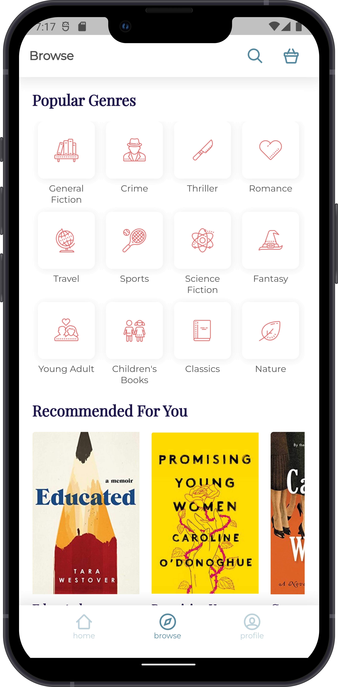

# Flutter Book Shop UI

```dart
class Revaldo extends FlutterProject {
    return {
      "title": "Flutter Book Shop UI",
      "description": "Make an UI of Book Shop App with Flutter",
    }
}
```

## Getting Started 🚀

```shell
- Clone the repo
- flutter pub get
- flutter run
```

## ScreenShot
&nbsp;&nbsp;
